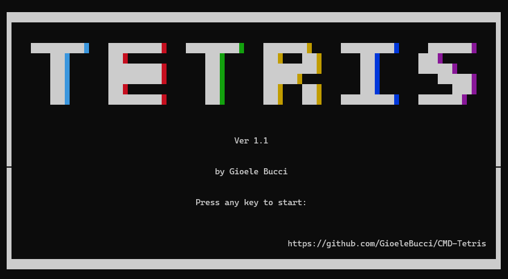
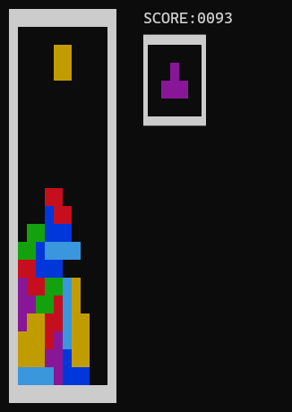

 <h2>Tetris on the command line</h2>
   

  

## Overview

A Tetris clone for Windows terminals entirely written in C.
The controls are:
* `a` and `s` for moving left and right
* `s` for soft-dropping
* `SPACE` for hard-dropping
* `z` and `x` for rotating

## License and distribution

This software comes without any license or warranty.
You are free to modify and redistribute it, although crediting is appreciated

*Note: Windows Defender will block the executable upon trying to run it for the first time*

---

  

